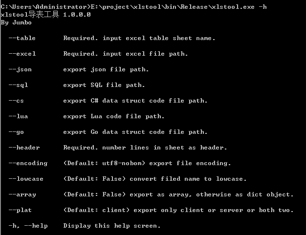
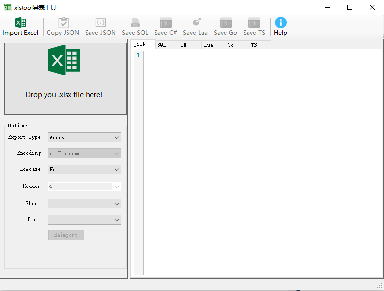

# xlstool导表工具

## 主要功能

- 支持读取 Excel 97-2003的 .xls格式和2007的 .xlsx格式；
- 支持多个表单导出；
- 支持键值表导出，暂时不支持sql；
- 把Excel表单转换成Json，并保存到一个文本文件中，支持将表中内容转换成**Array**数组，或者以第一列为ID的**字典对象**；
- 把Excel表单转换成Lua table，并保存到一个文本文件中；
- 把Excel表单转换成PostgreSQL 语句，并保存到一个文本文件中；
- 把Excel表单转换成CSharp、Go、TypeScript数据结构定义；
- 把Excel表单转换成csv、tsv文本格式；

## 命令行参数

* -i,–-input Required. 输入的Excel文件路径.

* -t,--table Required. 输入的表格sheet标签名称.

* -c,-–code.指定导出格式 json sql cs lua go ts tsv csv

* -h,-–header Required. 表格中有几行是表头.

* -e,-–encoding (Default: utf8-nobom) 指定编码的名称.

* -l,-–lowcase (Default: false) 自动把字段名称转换成小写格式.

* -a,--array 序列化成数组

* -p,--plat 表格导出平台标识client/server,不填默认双端支持

* -o,--out 导出文件路径

  

  

例如：**xlstool -i ExampleData.xlsx -t 英雄#HeroCfg  -c json HeroCfg  .json -h 4 **

## GUI工具

## 表格结构

ExampleData.xlsx：英雄#HeroCfg

| ID   | Name   | AssetName | HP   | Attack | Defence | ActPoints | Skills | Hit  | Dodge | Critical | Open  |
| ---- | ------ | --------- | ---- | ------ | ------- | --------- | ------ | ---- | ----- | -------- | ----- |
| int  | string | string    | int  | int    | int     | int       | int[]  | int  | int   | double   | bool  |
|      |        | client    |      |        |         |           |        |      |       |          |       |
| 编号 | 名称   | 资源编号  | 血   | 攻击   | 防御    | 战力      | 技能   | 命中 | 闪避  | 暴击     | 开启  |
| 1    | 大力士 | BS001     | 100  | 15     | 0       | 5         | 1;2    | 8    | 0     | 1.8      | TRUE  |
| 2    | 弓箭手 | BS002     | 352  | 22     | 3       | 32        | 3;4    | 3    | 4     | 2.4      | TRUE  |
| 3    | 步兵   | BS003     | 332  | 3      | 44      | 432       | 5;6;7  | 3    | 4     | 2        | FALSE |

第一行：字段名称

第二行：字段类型

第三行：双端标识 client、server，默认空表示双端

第四行：字段描述

第五行开始表示具体的数据

## 表格支持类型

| 表格   | json    | sql     | cs     | lua     | go      |
| ------ | ------- | ------- | ------ | ------- | ------- |
| int    | Number  | INTEGER | int    | number  | int     |
| int64  | Number  | Numeric | int64  | number  | int64   |
| double | Number  | Numeric | double | number  | float64 |
| string | String  | VARCHAR | string | string  | string  |
| bool   | Boolean | BOOLEAN | bool   | boolean | bool    |
| type[] | []      | VARCHAR | []     | []      | []      |

1. type[]是数组类型，其中type可以是int\int64\double\string\bool类型,例如1;2;3,“a”;"b";"c"
2. 如果要表示字典类型，建议通过ID索引到另外sheet表单
3. sql: PostgreSQL

## 键值表支持

ExampleData.xlsx：全局#GlobalCfg 

| K:V            |        |      |          |                  |
| -------------- | ------ | ---- | -------- | ---------------- |
| 键             | 类型   | 值   | 终端类型 | 描述             |
| BGMVolume      | double | 0.8  | client   | 背景音乐音量     |
| SFXVolume      | double | 0.8  | client   | 音效音量         |
| OpenNotice     | bool   | TRUE | client   | 开启公告         |
| TryReConnect   | int    | 3    | client   | 断线重连次数     |
| ConnectTimeout | int    | 10   | client   | 连接超时，单位秒 |
| OpenChapter    | int    | 100  |          | 开启章节         |

1. 第一行第一列标识K:V,表示当前标签页为键值表
2. 其他规则同上

参考项目：https://github.com/neil3d/excel2json
